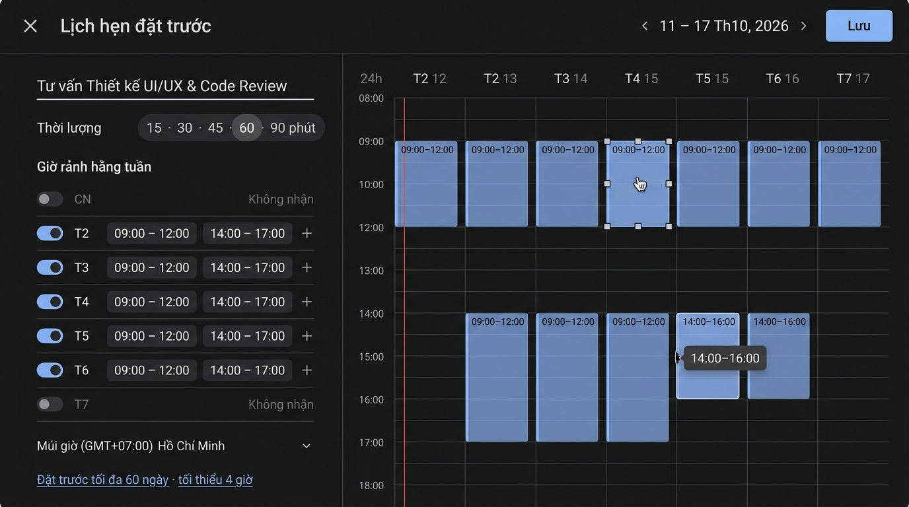

# Kế Hoạch Chỉnh Sửa Giao Diện: Lịch Hẹn Đặt Trước
* **Dựa trên báo cáo:** `docs/ui-audits/ui_audit_appointment_schedule.md` (19 findings)
* **Phương án thiết kế:** Clean Anti-Slop System — công cụ, không phải poster
* **File chính:** `src/components/modals/AppointmentScheduleModal.tsx`



> Mockup chỉ dùng để **định hướng bố cục & tương tác**. Bản sinh có vài sai lệch sẽ KHÔNG làm theo: fill block quá đậm (spec là 12%), nhãn block chiều không khớp giờ, vạch giờ hiện tại nằm sai cột. Spec trong tài liệu này là chuẩn.

---

## 1. Mục Tiêu Cải Tiến Cốt Lõi
* **Canvas phải thao tác được thật:** kéo để tạo khoảng, kéo mép để resize, kéo thân để di chuyển, click để chọn/xoá. (Fix #1, #3)
* **Một nguồn dữ liệu duy nhất:** panel trái và canvas cùng đọc/ghi `availability`; sửa một bên, bên kia cập nhật ngay. (Fix #2, #5)
* **Hiển thị đúng sự thật:** block và slot tính từ giờ thực + `duration`; không còn số hard-code. (Fix #4, #6, #7)
* **Gỡ sạch lớp trang trí:** bỏ badge, mini-pill, dashed, blur, shadow, eyebrow, nút trùng. (Fix #11–16, #19)
* **Màu qua token:** không còn hex trong TSX. (Fix #19)

---

## 2. So Sánh Kiến Trúc Bố Cục (Before vs. After)
| Khu Vực | Hiện Trạng | Thiết Kế Mới | Lợi Ích |
|---|---|---|---|
| Header | X + eyebrow pill + h2 + nhãn tuần + nút "Lưu & Hoàn tất" | X + 1 tiêu đề "Lịch hẹn đặt trước" + điều hướng tuần `‹ ›` + 1 nút "Lưu" | Bỏ lặp nghĩa, thêm chức năng thật (đổi tuần) |
| Panel trái | 460px, card cho Duration, card mỗi ngày, giờ là `<span>` | 340px, phẳng + divider. Duration = segmented control. Mỗi ngày: toggle + nhiều khoảng giờ sửa được + nút `+` | Trả ~120px cho canvas; nhập liệu thật |
| Footer trái | Hủy + "Tiếp tục / Lưu" | Bỏ. Hủy = nút X / Esc | Hết nút trùng |
| Trục giờ | `grid-cols-8` (~1/8 width), nhãn "8 SA" | `grid-cols-[56px_repeat(7,1fr)]`, nhãn 24h `08:00` | Thẳng hàng header/body, đọc nhanh |
| Block khả dụng | Dashed + tint + blur + shadow + badge + tiêu đề + 8 pill + footer text | Fill 12% + thanh nhấn trái 2px + 1 nhãn giờ `09:00–12:00` + hairline mỗi slot | Đúng vị trí, nhìn ra số slot ngay |
| Tương tác canvas | Không có | Drag-create / resize / move / Delete; tooltip giờ khi kéo; snap theo 15 phút | Giải quyết phàn nàn chính |
| Vạch giờ | `top:155px` cố định, sai cột | Tính từ `new Date()`, chỉ ở cột hôm nay thật, cập nhật mỗi phút | Chính xác |

---

## 3. Hệ Thống Token & Phong Cách Mới
**Nguồn:** `:root` trong `src/index.css` đã có sẵn bộ biến (`--surface-*`, `--text-*`, `--border-*`, `--google-blue`). Chỉ cần ánh xạ sang Tailwind v4 bằng `@theme inline` — **thêm mới, không sửa biến cũ**.

```css
@theme inline {
  --color-canvas: var(--surface-canvas);
  --color-panel: var(--surface-container-low);
  --color-raised: var(--surface-container-high);
  --color-line: var(--border-grid);
  --color-line-strong: var(--border-subtle);
  --color-fg: var(--text-primary);
  --color-fg-2: var(--text-secondary);
  --color-fg-3: var(--text-muted);
  --color-accent: var(--google-blue);
  --color-accent-hover: var(--google-blue-hover);
  --color-now: var(--google-rose);
}
```

| Nhóm | Quy định |
|---|---|
| **Màu** | Nền `canvas`, panel `panel`, hover/input `raised`. Accent (`accent`) **chỉ** cho: nút Lưu, toggle bật, block khả dụng, focus ring, segment đang chọn. Icon heading: bỏ. Lỗi/xoá: `--google-rose`. |
| **Block** | `bg-accent/12`, `border-l-2 border-accent`, `rounded-md`. Đang chọn: `ring-1 ring-accent`. Đang kéo: `bg-accent/20`. Không shadow, không blur, không dashed. |
| **Typography** | Geist (đã có). Scale: 15/600 tiêu đề, 13/500 nhãn, 13/400 nội dung, 12 mono cho giờ. **Sàn 12px.** Không `uppercase tracking-*`. |
| **Giờ** | 24h `HH:mm` cho cả `vi` và `en` (đơn giản, không nhập nhằng SA/CH). Nhãn khác lấy từ `translations.ts`. |
| **Shape** | `rounded-md` (6px) cho block/input, `rounded-full` chỉ cho toggle & nút tròn icon. Border 1px `line`. |
| **Spacing** | Hàng ngày cao 44px, padding panel 20px, nhịp 4/8/12/20. Hour row 48px (thay 64px) → 08:00–20:00 vừa 1 màn 768px. |
| **Focus/A11y** | `focus-visible:ring-2 ring-accent ring-offset-2 ring-offset-canvas`. Dialog `role="dialog" aria-modal aria-labelledby`, Esc đóng, focus vào input tiêu đề khi mở. Block có `tabIndex=0`, `Delete`/`Backspace` xoá, `↑/↓` dời 15 phút, `Shift+↑/↓` resize. |
| **Motion** | Chỉ CSS transition 120ms cho hover/selected. Không animate-in khi render. `prefers-reduced-motion` tắt transition. |

> Không dùng `progressive-blur` / `css-border-gradient` của MengTo: màn hình là công cụ dày đặc, không có nội dung cuộn dưới thanh điều hướng và không có card "hero". Thêm vào sẽ chính là slop vừa gỡ.

---

## 4. Kế Hoạch Thay Đổi Từng File (Code Impact Plan)

### 4.1 Mô hình dữ liệu — `src/types/index.ts`
Kiểu hiện tại chỉ có một khoảng/ngày (`startTime`, `endTime`). Để hỗ trợ nhiều khoảng (9–12, 14–17) cần mở rộng:
```ts
export interface TimeRange { id: string; start: number; end: number } // phút từ 00:00
export interface DailyAvailabilitySlot {
  id: string; dayIndex: number; dayNameVi: string; dayNameEn: string;
  isAvailable: boolean;
  ranges: TimeRange[];
  /** @deprecated giữ để tương thích */ startTime?: string; endTime?: string;
}
```
> ⚠️ **Cần bạn duyệt:** đây là thay đổi kiểu dùng chung. Đã kiểm tra: `DailyAvailabilitySlot` **chỉ** được dùng trong `AppointmentScheduleModal.tsx` → rủi ro thấp. Lưu bằng phút (number) để tính vị trí/va chạm đơn giản; chỉ format khi hiển thị.

### 4.2 `src/index.css`
- [ ] Thêm khối `@theme inline` ở mục 3 (append, không sửa biến cũ).

### 4.3 `src/components/modals/AppointmentScheduleModal.tsx`
**Xoá:**
- [ ] Eyebrow pill (L151-153), nhãn tuần tĩnh (L161-163)
- [ ] Footer Hủy/"Tiếp tục / Lưu" (L338-354)
- [ ] Card Duration (L192), card mỗi ngày (L250-256), icon `Clock/Repeat/Globe` trước heading
- [ ] Toàn bộ nội dung trong block: badge, h4, giờ cứng, 8 pill, "Khách có thể đặt lịch" (L431-459)
- [ ] `border-dashed`, `shadow-lg`, `backdrop-blur-xs`, `animate-in` (L425); `backdrop-blur-sm` ở overlay (L137); `select-none` root
- [ ] `hoursList` cố định có nhãn SA/CH (L27-39)
- [ ] Mọi hex `[#xxxxxx]` → class token

**Thay đổi bố cục:**
- [ ] Header: X · tiêu đề `h2#appt-title` · spacer · `‹ tuần ›` (state `weekOffset`) · nút "Lưu"
- [ ] Panel trái `w-[340px]`: input tiêu đề → segmented Duration (15/30/45/60/90/120) → "Giờ rảnh hằng tuần" + select lặp lại → 7 hàng ngày → múi giờ → phạm vi đặt lịch (biến thành nút mở popover nhỏ 2 field số: tối đa N ngày, tối thiểu M giờ — hoặc tạm ẩn icon nếu chưa làm)
- [ ] Hàng ngày: `Switch` · tên ngày · danh sách `TimeRangeInput` (2 `<input type="time" step=900>`) · nút xoá khoảng · nút `+` thêm khoảng (mặc định khoảng 1 giờ sau khoảng cuối)
- [ ] "Sao chép tất cả" → menu nhỏ trên mỗi hàng: "Áp dụng cho T2–T6" (copy từ hàng hiện tại, không cố định Thứ 2)
- [ ] Canvas: `grid-cols-[56px_repeat(7,1fr)]` cho header và body; `HOUR_PX = 48`, `START_H = 8`, `END_H = 20`, cuộn dọc

**Thêm logic (component nội bộ, cùng file hoặc tách nhỏ):**
- [ ] `minToPx(m) = (m - START_H*60) / 60 * HOUR_PX`; `pxToMin` snap 15 phút, clamp [START, END]
- [ ] `DayColumn`: `onPointerDown` trên vùng trống → tạo `draft` range; `pointermove` cập nhật; `pointerup` → `addRange(day, draft)` nếu ≥ 15 phút. Dùng `setPointerCapture`.
- [ ] `RangeBlock`: vùng 6px trên/dưới = resize handle (`cursor-ns-resize`), thân = move (`cursor-grab`). Click = chọn. Hover hiện nút xoá nhỏ góc phải.
- [ ] Bên trong block: vẽ hairline mỗi `duration` phút (`repeating-linear-gradient` theo `HOUR_PX*duration/60`) — 1 div, không render N phần tử. Nếu block còn chỗ thừa < duration ở cuối: tô nhạt phần đó (không thành slot).
- [ ] Tooltip giờ khi kéo/resize (`09:00–12:00`).
- [ ] `normalizeRanges`: sort + gộp khoảng chồng lấn sau mỗi thao tác.
- [ ] Tạo khoảng trên ngày đang tắt → tự bật ngày. Xoá khoảng cuối → ngày về "Không nhận".
- [ ] Now-line: state `now` cập nhật `setInterval 60s`, chỉ render nếu cột là hôm nay thật (`new Date()`), ẩn nếu ngoài [START, END].
- [ ] Keyboard: Esc đóng modal (hoặc huỷ draft nếu đang kéo); Delete xoá block đang chọn; mũi tên dời/resize.
- [ ] `handleSave`: validate (tiêu đề không rỗng, có ≥ 1 khoảng, mọi khoảng ≥ duration) → toast lỗi nếu sai. Mô tả sinh từ dữ liệu thật: thời lượng, các ngày + khoảng, múi giờ, chế độ lặp. Giữ nguyên chữ ký `addEvent`, `showToast`, `closeModal`.
- [ ] Trục giờ & header ngày hiển thị đúng `timezone` label (VD `GMT+7`) từ state.

### 4.4 `src/i18n/translations.ts`
- [ ] Thêm key: `appt.title`, `appt.save`, `appt.duration`, `appt.weekly`, `appt.unavailable`, `appt.addRange`, `appt.applyWeekdays`, `appt.timezone`, `appt.window`, `appt.err.*`, tên thứ viết tắt. Bỏ chuỗi VN hard-code trong `title`/`option`.

---

## 5. Phương Án Xác Minh (Verification Plan)
* [ ] `npm run build` không lỗi TypeScript.
* [ ] Kéo trên cột trống T3 từ 14:00→16:00 → block xuất hiện đúng hàng, panel trái T3 hiện thêm khoảng `14:00 – 16:00`.
* [ ] Sửa `<input type="time">` ở panel trái → block dời theo ngay.
* [ ] Resize block chạm block khác → tự gộp, không chồng.
* [ ] Đổi Duration 60 → 30 → số hairline trong block 09:00–12:00 từ 3 lên 6 ô.
* [ ] Tạo khoảng trên CN (đang tắt) → CN tự bật.
* [ ] Vạch giờ chỉ ở cột hôm nay thật; ẩn khi xem tuần khác.
* [ ] Esc, Tab, Delete, mũi tên hoạt động; focus ring nhìn thấy.
* [ ] Lưu khi chưa có khoảng nào → toast lỗi, modal không đóng.
* [ ] Màn 1366×768 và 1920×1080: header/body thẳng cột, khung 08:00–20:00 hiển thị không vỡ.
* [ ] `grep "\[#" AppointmentScheduleModal.tsx` → 0 kết quả.
* [ ] Chuyển `language` sang `en` → không còn chuỗi tiếng Việt.

**Side-effects cần lưu ý:** `addEvent` vẫn tạo 1 event như cũ (chỉ đổi `description`/`time` lấy từ dữ liệu thật). Khối `@theme` trong `index.css` thêm utility mới, không đổi class đang dùng ở màn khác.
